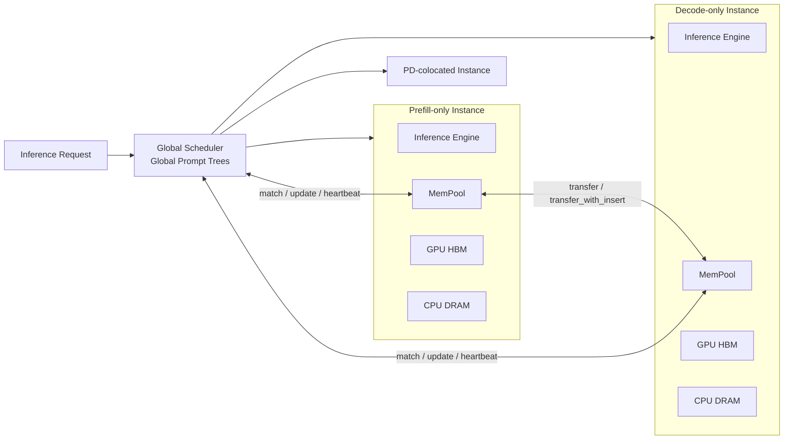

# MemServe 解读：统一 KV 生命周期，而不是一颗独立的 Memory Pool 芯片

MemServe 讨论的不是如何造一颗更大的内存芯片，而是如何把 LLM Serving 中原本被当作请求临时数据的 KV Cache，提升为跨请求、跨 Prefill/Decode 实例管理的分布式状态。论文的核心贡献是 MemPool 软件抽象、PD 分离与 Context Caching 的组合，以及基于全局 Prompt Tree 的 locality-aware scheduling。它证明了统一 KV 生命周期能够改善 TTFT 和 JCT，但没有证明独立 Scale-up Memory Appliance、跨节点 RDMA Memory Pool 或 Pool-side Attention 的系统价值。

> **核心判断：MemServe 的本质是“分布式 KV 控制面与数据移动 API”，不是“独立内存池硬件”。它最值得借鉴的是对象生命周期、位置感知索引和计算/传输决策；最不能直接外推的是单机 NVLink/NCCL 结果到 Scale-up Memory Pool 芯片。**

## 关键结论

- MemServe 将 Context Caching 的跨请求复用和 P/D Disaggregation 的请求内迁移，统一到同一个 MemPool API。关键创新是状态管理闭环，而不是新的物理内存介质。
- MemPool 分布部署在 inference instance 内，管理本地 CPU DRAM 与 GPU HBM。论文中的“elastic”表示实例和内存资源可加入或退出，不表示存在独立、全局一致的共享内存设备。
- `transfer_with_insert` 是最有价值的接口设计：一次操作同时完成 KV 传输与目标端索引发布，减少控制往返，并建立“数据完成后才能可见”的状态转换。
- Global Prompt Tree 解决的是“KV 在哪里”和“请求应该去哪里”，但当前实现通过响应路径更新、TTL 修复陈旧信息，仍是 best-effort directory，不是强一致 Pool metadata service。
- 论文在单台 8×H800 DGX 上完成，GPU 间使用 NCCL send/recv；只要一端是 DRAM，就使用 socket。论文明确没有实现 RDMA，因此不能据此判断 Scale-out RDMA 或跨机 Scale-up fabric 的性能。
- Huge-page-like KV aggregation 显著减少 NCCL API 调用。它证明了 scatter-gather/descriptor aggregation 对 KV 数据面的重要性，同时也暴露了“连续大块 staging”可能带来的分配与碎片问题。
- 对当前 Scale-up Memory Pool POC，MemServe 是 API、索引和调度基线，不是物理架构基线。对 Attention Pool 芯片，它只覆盖 KV placement 与 transfer，没有改变 Attention 的执行位置。

## 目录

1. 论文要解决的真正问题
2. MemServe 架构：三层控制与一个逻辑内存池
3. MemPool API：从临时 Tensor 到可管理状态
4. PD-Caching 的四步演进
5. Global Prompt Tree 与调度成本模型
6. 为什么聚合布局比 Layer-wise Transfer 更关键
7. 实验结果应该如何解读
8. 证据边界与技术问题
9. 与 Mooncake、Scale-up Pool 和 Attention Pool 的区别
10. 对 Memory Pool 芯片设计的启示
11. 对池内 Attention 芯片设计的启示
12. 可复现实验与验证路径

---

## 1. 论文要解决的真正问题

论文标题中的 Context Caching、Disaggregated Serving 和 Elastic Memory Pool 容易被读成三个并列功能。实际上，作者首先识别的是一个状态语义冲突。

### 1.1 Inter-request 与 Intra-request 优化互不闭合

Context Caching 是跨请求优化：一个请求结束后保留 KV，未来具有相同 Prefix 的请求可以跳过部分 Prefill。

P/D Disaggregation 是请求内优化：Prefill 产生 Active KV，再把它交给 Decode 实例继续生成。

两种优化单独成立，但组合时出现状态断裂：

```text
Context Caching:
Request A finishes -> preserve KV -> Request B reuses KV

P/D Disaggregation:
Prefill creates KV -> transfer to Decode -> Decode appends KV

Combined system:
谁拥有最终 KV？
Prefill 如何获得 Decode 新增的历史？
下一轮请求应该路由到 Prefill 还是 Decode？
KV 转移后何时可以被索引命中？
```

传统 inference engine 往往把 KV 视为单实例、单请求的内部 Tensor。MemServe 的判断是：只要 KV 生命周期跨越请求或实例，它就不再只是 kernel buffer，而是分布式系统状态。

### 1.2 第二个问题是 locality 与 load balancing 冲突

Context Caching 希望请求前往已经保存最长 Prefix KV 的实例；Load Balancing 希望请求前往队列最短的实例。只看 locality 会形成热点，只看 load 会丢失缓存收益。

因此调度决策实际是：

$$
p^*=	ext{argmin}_p
\left[
T_{queue}(p)+T_{exec}(x,y_p)
\right]
$$

其中：

- $x$ 是当前 Prompt 长度；
- $y_p$ 是实例 $p$ 已缓存的 Prompt 比例；
- $T_{queue}$ 是当前未完成请求的预计执行时间；
- $T_{exec}$ 是给定 Prefix 命中后的 Prefill 执行时间。

**本质不是命中率最大化，而是包含缓存收益后的完成时间最小化。**

---

## 2. MemServe 架构：三层控制与一个逻辑内存池

MemServe 包含三个主要组件：Global Scheduler、Inference Instances 和 MemPool。



### 2.1 “Pool”是逻辑聚合，不是共享地址空间

论文明确说明：MemPool 运行在每个 inference instance 内，管理该实例的本地 CPU DRAM 与 GPU HBM。各 MemPool 通过分布式 API 共同构成逻辑资源池。

这意味着：

- 没有一块所有实例直接 load/store 的全局共享 HBM；
- 地址中编码了 instance ID；
- 远端状态通过 `transfer` 显式移动；
- 故障与扩缩容粒度是整个 inference instance；
- Pool elasticity 来自实例加入、移除和本地内存分配，不是 CXL Dynamic Capacity 或硬件级 memory composability。

准确分类应是：

| 维度 | MemServe |
|---|---|
| Pool 类型 | 软件定义的分布式 KV Memory Pool |
| 内存介质 | Inference instance 内的 GPU HBM + CPU DRAM |
| 访问语义 | Object/block allocation + explicit transfer |
| 数据可见性 | 目标端接收完成后插入本地索引 |
| 地址空间 | 地址编码 instance ID，不是透明全局地址空间 |
| 计算位置 | Prefill/Decode GPU，Attention 不在 Pool 侧执行 |

> **Xinyi 视角：名字叫 Elastic Memory Pool，但它没有凭空长出一座内存机柜。弹性来自软件把散落在实例里的 HBM/DRAM 组织起来，而不是来自一块神奇的全局内存。**

### 2.2 Active KV 与 Historical KV 是两个生命周期状态

MemServe 区分：

- **Active KV**：当前请求仍在使用和增长；
- **Historical KV**：请求完成后保留，供未来 Prefix 命中。

这个区分很重要。KV 的物理字节可以不变，但其所有权、索引可见性和淘汰策略已经改变。`insert` 操作相当于把 Active KV 退休为 Historical KV，并建立 Token Prefix 到地址列表的映射。

---

## 3. MemPool API：从临时 Tensor 到可管理状态

MemPool 提供三类 API。

### 3.1 Memory Block API

| API | 含义 |
|---|---|
| `alloc_mem(size, type, id)` | 在指定实例分配 HBM、DRAM 或混合介质 block |
| `free_mem(addrList)` | 释放 block |
| `swap_out(num_blocks)` | 从 HBM 迁移到 DRAM |
| `swap_in(addrList)` | 从 DRAM 恢复到 HBM |

分配器使用固定大小 block，与 PagedAttention 的 page/block 模型对齐。这降低了接入 inference engine 的复杂度，但会把 metadata、离散布局和网络 scatter-gather 压力暴露给数据面。

### 3.2 Index API

| API | 含义 |
|---|---|
| `insert(tokenList, addrList, flags)` | 发布 Token Prefix 到 KV block 的映射 |
| `match(tokenList)` | 返回最长可复用 Prefix 对应的地址列表 |
| `delete(tokenList)` | 删除索引映射 |

MemServe 使用 Token-based Radix Tree，而不是 Session ID 或 Document ID。优点是跨 Session 也能发现相同 Prefix；代价是索引更大、更新更频繁，并且需要处理 tokenizer/model/version 隔离。

论文基于 vLLM 的 16-token block，使 Radix Tree node 指向 16-token 粒度的 KV block。这里存在一个重要工程结论：**索引粒度必须与 KV allocator 和 inference kernel 的消费粒度一致，否则命中之后仍需重排或复制。**

### 3.3 Distributed Transfer API

| API | 含义 |
|---|---|
| `transfer(...)` | 在实例之间移动 KV，可指定或按需分配目标地址 |
| `transfer_with_insert(...)` | 传输完成后在目标实例执行 `insert` |

`transfer` 的流程是：

```text
Sender requests transfer
  -> Receiver allocates destination HBM/DRAM
  -> Receiver returns dstAddrList and parallelism metadata
  -> Sender partitions KV for target TP/PP layout
  -> Data transmission
  -> Receiver confirms completion
  -> Optional index insertion
  -> Sender observes API completion
```

它试图屏蔽三类异构性：

1. Sender/Receiver 的 TP、PP 配置不同；
2. KV 位于 HBM 或 DRAM；
3. 底层链路可能是 NVLink、PCIe、RoCE 或其他互连。

但是论文实现只覆盖其中一部分：HBM-to-HBM 使用 NCCL send/recv；只要任一端包含 DRAM，就使用 socket。所谓网络抽象是 API 设计目标，不等于所有 backend 已经实现或验证。

### 3.4 `transfer_with_insert` 的架构价值

该接口不仅节省一次控制往返，更重要的是定义了发布顺序：

$$
DataComplete \rightarrow IndexPublish \rightarrow MatchVisible
$$

对未来 Memory Pool 芯片，这应演化为明确的硬件/固件事务：

```text
ALLOC -> DMA_WRITE -> CRC/ECC_VERIFY -> PUBLISH(epoch) -> VISIBLE
```

如果先发布索引再完成数据写入，Reader 可能读到 partial KV。论文没有完整讨论 epoch、ABA、Reader/Eviction race，但接口已经指出正确的原子性边界。

---

## 4. PD-Caching 的四步演进

MemServe 最清楚的贡献，是把“P/D 分离如何获得完整 Context Caching”拆成四个可验证阶段。

| 阶段 | Prefill Cache | Decode Cache | Decode→Prefill 回传 | 结果 |
|---|---:|---:|---:|---|
| PD-Basic | 否 | 否 | 否 | P 生成 KV 并传给 D，没有跨请求复用 |
| PD-Caching-1 | 是 | 否 | 否 | 可复用系统 Prompt，但忽略 Decode 新增历史 |
| PD-Caching-2 | 是 | 是 | 否 | D 可增量复用，P 的历史仍停留在旧轮次 |
| PD-Caching-3 | 是 | 是 | 是 | D 完成后把新增 KV 回传 P，形成完整多轮历史 |

### 4.1 PD-Caching-1：只保存 Prefill 结果

Prefill 完成后执行 `insert`。未来相同系统 Prompt 可以命中，但多轮对话中 Decode 生成和消费的新上下文没有返回 P。每一轮 P 都可能重复计算此前的对话历史。

### 4.2 PD-Caching-2：Decode 也保存历史

P 使用 `transfer_with_insert` 把 Active KV 交给 D；D 完成请求后也执行 `insert`。若调度器把下一轮请求送到同一 D，则 P→D 只需要传输增量 KV。

问题是 Prefill 侧仍然缺失 Decode 新增历史，因此 Prefill 的缓存收益不会随着会话轮数增长。

### 4.3 PD-Caching-3：Decode 新增 KV 回流 Prefill

请求结束后，D 使用 `transfer_with_insert` 把 Decode 阶段新增 KV 送回 P。此后 P 和 D 都拥有持续增长的历史 Prefix。

代价也很明确：同一份历史 KV 可能同时存在 P 和 D，Decode 产生的数据还要反向传输。MemServe 用额外容量和网络流量换取后续重算减少。这正是 Memory Pool 需要回答的问题：

$$
Benefit_{reuse}
>
Cost_{replication}+Cost_{transfer}+Cost_{capacity}
$$

MemServe 证明了该组合在其 workload 和单机环境下有效，但没有给出跨机网络、长期容量、淘汰和复制因子的完整经济模型。

---

## 5. Global Prompt Tree 与调度成本模型

### 5.1 为什么需要全局 Prompt Tree

每个 MemPool 有本地 Radix Tree。Global Scheduler 维护三组全局 Prompt Tree：Prefill-only、Decode-only 和 PD-colocated。

请求到达后：

1. Scheduler 对 Prompt tokenize；
2. 并行查询不同实例类型的 Prompt Tree；
3. 获得各实例可命中的 Prefix 长度；
4. 结合实例负载选择目标；
5. 如其他实例拥有额外 KV，则决定传输还是重算；
6. 请求完成并经过 Scheduler 返回时，更新全局树。

这相当于一个 KV directory：

```text
Token Prefix -> [(Instance ID, KV AddrList, Cached Length)]
```

### 5.2 调度器不追求最长 Prefix，而追求最低预计时间

论文的目标函数可以写成：

$$
p^*=\arg\min_p
\left[
\sum_{r\in Queue_p}T_{exec}(x_r,y_{r,p})
+T_{exec}(x,y_p)
\right]
$$

这比单纯 Least Load 或 Session Affinity 更完整，因为它把 locality 转化成执行时间，再与排队成本统一比较。

### 5.3 Transfer 与 Recompute 的边界

如果另一实例 $p'$ 保存更多 Prefix，只有当下式成立才值得搬运：

$$
T_{transfer}(y_p,y_{p'})
\le
T_{exec}(x,y_p)-T_{exec}(x,y_{p'})
$$

这是 MemServe 对当前 Scale-up Memory Pool 最有价值的算法启示。Memory Pool 不应把“命中”自动解释为“必须 Fetch”。真正的动作空间至少包括：

- Local reuse；
- Remote fetch；
- Remote execution；
- Recompute；
- Fetch compressed KV；
- Admission reject 或 defer。

### 5.4 Operator-level Cost Model

MemServe 没有只拟合一个端到端黑盒模型，而是把算子分为 compute-bound、memory-bound 和 constant 三类，再组合为执行时间。

优点是 TP/PP 改变时具有更好的可迁移性。论文报告，在 TP=2 的实验中，直接缩放 architecture-level 模型会因 Amdahl's Law 产生更高误差；operator-level 模型更容易解释。

但其 Transfer 模型仍然偏弱：论文用数据量除以最大带宽估算传输时间，没有显式建模 queue、并发、NCCL launch、scatter-gather、拥塞和尾延迟。对 Scale-up TP/KV 共网场景，这些恰好是主要变量。

### 5.5 Global Tree 是 best-effort，不是强一致 Directory

Scheduler 只在响应经过它时更新全局树，不感知实例内部的实时 eviction。论文通过分钟级 TTL 处理陈旧记录。

因此可能发生：

```text
Global tree says Prefix exists
  -> Scheduler routes for locality
  -> Local MemPool has already evicted KV
  -> Match miss / recompute / reroute
```

对软件 serving 系统，这可以接受；对 Memory Pool 芯片或严格 TTFT SLO，Directory 需要 epoch、lease、eviction notification 或 ownership protocol，不能只依赖 TTL。

---

## 6. 为什么聚合布局比 Layer-wise Transfer 更关键

### 6.1 Paged KV 对网络并不友好

PagedAttention 用小 block 改善 HBM 利用率，但一个模型每层分别存 K/V，会形成大量离散 block。若模型有 $L$ 层，每个 token block 需要约 $2L$ 个 K/V block。

NCCL send/recv 一次只传一个连续 block，又没有 gather/scatter API。因此网络 API 调用数近似为：

$$
N_{network\ calls}\approx 2L\times N_{token\ blocks}
$$

这说明内存管理最优粒度与网络传输最优粒度并不一致：

- HBM allocator 偏好小页，减少内部碎片；
- 网络偏好大 payload，摊薄 launch、descriptor 和 completion 成本。

### 6.2 三种传输方式

| 方式 | Transfer API 次数 | Network API 次数 | 优点 | 缺点 |
|---|---:|---:|---|---|
| By-layer | $2L$ 量级 | $2L$ 量级或更多 | 低负载下可重叠计算与通信 | 高频小传输，高负载下 queue/API 开销大 |
| By-request | 1 | 仍可能为 $2L$ 量级 | 控制简单 | 离散 block 仍导致大量网络调用 |
| By-request-agg | 1 | 约 1 个大调用 | 显著降低调用次数 | 需要聚合布局、大块空间和额外 kernel 支持 |

论文通过类似 huge page 的聚合，把原来每层两个 K/V block 聚合成一个大 block，并修改 `paged_attention`、`swap_blocks` 和 `reshape_and_cache` CUDA kernel。

论文结果显示：低负载下 By-layer 可能最优，但负载升高后 By-request-agg 的 P50/P99 更好。原因不是 overlap 失效，而是细粒度网络调用产生的排队和软件开销超过 overlap 收益。

### 6.3 对芯片设计的直接启示

正确方向不是强迫 KV 永久连续，而是支持：

- Scatter-gather descriptor；
- Descriptor chaining；
- Doorbell batching；
- 一次提交多个 layer/block；
- Target-side placement；
- Completion coalescing；
- 目标地址直接写入，无额外 staging。

如果硬件支持 SGL，就可以保留 Paged KV 的分配效率，同时获得大事务的网络效率。MemServe 的聚合方案是对 NCCL P2P 原语不足的有效软件补偿，不一定是专用 Pool 芯片的最终布局。

---

## 7. 实验结果应该如何解读

### 7.1 实验环境

| 项目 | 配置 |
|---|---|
| 服务器 | 单台 NVIDIA DGX H800 |
| GPU | 8×H800 80GB |
| GPU 互连 | NVLink，论文标注 400 GB/s |
| CPU/内存 | 192-core Intel Xeon，2 TB DRAM |
| 软件 | Ubuntu 20.04、Linux 5.16.7、CUDA 12.2 |
| 模型 | Llama2-13B，TP=2 |
| Baseline | vLLM 0.4.0 |
| 传输 | HBM 间 NCCL send/recv；涉及 DRAM 时 socket |
| RDMA | 未实现 |

选择 Llama2-13B 的原因是单机可以创建四个 inference instance。这个选择有利于展示调度与组合机制，但不能代表更大模型、跨机网络或高 TP 下的行为。

### 7.2 Workload

论文使用三类 workload：

| Workload | 特征 | 更敏感的指标 |
|---|---|---|
| ShareGPT | 对话、多轮依赖、生成较长 | Decode 资源、JCT、TPOT |
| LooGLE | 长 Prompt、短输出、共享文档 Prefix | Prefix reuse、TTFT |
| ReAct | Agent 推理与行动、长 Prompt、共享示例 | 多轮复用、TTFT/JCT |

到达过程使用 Poisson 分布模拟，并保持同一 Session 的因果顺序。真实数据集提供 Prompt/Output/Prefix 分布，但真实生产 arrival burst、tenant skew 和热点变化没有被保留。

### 7.3 端到端收益

论文报告：

| Workload | P/D 分离相对 PD-colocated | 加入 Context Caching 的进一步收益 |
|---|---|---|
| ShareGPT | Average JCT 改善 30%，P99 JCT 改善 42% | Average/P99 JCT 再改善 17%/29%；Average/P99 TTFT 改善 58%/45% |
| LooGLE | Average/P99 JCT 改善 10.3%/10.8% | Average/P99 JCT 再改善 26.9%/22.5%；Average/P99 TTFT 改善 56.2%/45.2% |
| ReAct | Average/P99 JCT 反而增加 40.8%/53.1% | 在分离基础上 JCT 改善 26.7%/21.4%；TTFT 改善 78.5%/84.9% |

这里最重要的不是最大百分比，而是 ReAct 的反例：**P/D 分离本身可能恶化 JCT。** 长 Prompt、资源比例、P→D 传输和队列不匹配时，分离增加的成本会超过干扰隔离收益。

Context Caching 能部分修复这个问题，但不能据此推出任何 workload 都应该 P/D 分离。

### 7.4 Microbenchmark 的有效结论

- Memory API 约为每 block 800 ns 的线性开销。
- 对最多 4K tokens 的测试，`insert` 最多约 0.7 ms，`match` 对 cached ratio 不敏感。
- Prompt-tree policy 相比 Session-based policy，在特定 LooGLE duplication 测试中将 P99 TTFT 改善约 59%。
- Context Caching 的收益随 cached ratio 和 Prompt length 增加；当 KV 在 DRAM 时，需要 swap-in，但在达到一定命中阈值后，减少计算仍可覆盖搬运成本。
- 聚合 block 能显著降低 NCCL 传输开销，但 communicator 数量增加也会消耗额外 HBM。

### 7.5 不能从实验推出的结论

论文没有证明：

- 跨节点 RDMA 下仍有相同收益；
- Scale-up fabric 比 Scale-out fabric 更好；
- 独立 Storage 节点比复用 inference instance 内存更好；
- Pool 容量扩展到百万级 key 后索引仍不是瓶颈；
- 多租户、长期运行、eviction storm 下 P99 稳定；
- 一致性、复制和故障恢复达到生产级；
- Memory Pool 芯片或池端 Attention 具有更优 PPA/TCO。

---

## 8. 证据边界与技术问题

### 8.1 单机实验限制了“Distributed”的物理含义

系统在逻辑上有多个 Prefill/Decode instance，但都位于一台 DGX H800。NVLink、PCIe、socket 与跨机 RDMA 在固定延迟、拥塞、失败模式和 CPU participation 上差异很大。

论文声称 Transfer API 可屏蔽 RoCE 等互连是合理的接口目标，但实现没有验证这个抽象是否无泄漏。实际系统中，backend 能力会改变：

- 是否支持目标地址 direct write；
- 是否需要预注册；
- 是否支持 SGL；
- completion ordering；
- 跨 TP layout 的 scatter；
- failure retry 和 idempotence；
- queue pair、NIC memory 和 CPU overhead。

### 8.2 Baseline 不是完全同栈比较

PD-colocated baseline 使用 vanilla vLLM；其他三种配置使用经过 MemPool 改造的 vLLM。论文另有 microbenchmark 比较 hash 与 radix index，但端到端收益仍混合了：

- P/D topology；
- Context Caching；
- Radix index；
- 聚合 KV layout；
- Prompt-tree scheduling；
- MemPool runtime。

因此结果证明的是 MemServe 整体设计有效，不能把所有收益分别归因到 MemPool、P/D 或调度器。

### 8.3 Global Prompt Tree 存在 metadata staleness

TTL 只能限制陈旧时间，不能保证命中。真正 Pool directory 应定义：

- Owner 与 replica；
- Generation/epoch；
- Publish/evict 顺序；
- Lease 或 invalidation；
- Reader 与 eviction race；
- Failed instance 的 fencing；
- Scheduler miss 后的 fallback。

### 8.4 故障处理只到实例级 timeout

论文描述实例故障后，in-flight request timeout；Cluster Manager 通过 heartbeat 检测，广播新配置，其他实例释放由故障实例分配的 block。

尚未闭合：

- Transfer 中途失败后的 partial block；
- 已发布但未完整复制的 Historical KV；
- Retry 是否重复 insert；
- ABA 与 address reuse；
- Global Tree 中陈旧 owner；
- Decode 新增 KV 尚未回传 P 时的失败；
- KV 数据错误是否会被静默用于推理。

### 8.5 长期容量与淘汰没有被充分评估

Context Cache 把 KV 生命周期从请求级延伸到潜在无限期。随之而来的核心问题是 capacity admission、reuse distance、eviction policy 和 metadata scaling。

论文重点评估 Prefix 命中收益，没有给出完整的：

- Pool occupancy sweep；
- Working-set/capacity ratio；
- Million-key index；
- Hot Prefix fan-out；
- Fragmentation；
- Eviction amplification；
- Replication cost；
- Per-tenant quota。

所以 MemServe 证明了 API 和组合机制，不等于证明了大规模弹性 Pool 的容量控制。

---

## 9. 与 Mooncake、Scale-up Pool 和 Attention Pool 的区别

| 系统 | KV 主要位置 | 访问方式 | 计算位置 | 核心价值 |
|---|---|---|---|---|
| MemServe | Serving instance 内 HBM/DRAM | MemPool block + explicit transfer | Prefill/Decode GPU | 统一 Context Caching 与请求内分离 |
| Mooncake | GPU 集群未充分利用的 CPU DRAM、SSD、NIC 等分布式资源 | Mooncake Store/传输引擎 | GPU | 大规模 KV-centric serving 与 SLO 调度 |
| 当前 Scale-up Device-Memory Pool | 独立 Storage accelerator 的 Device Memory | P/S/D direct device transfer | P/D accelerator | 低软件栈开销的远端 Prefix KV reuse |
| 被动 Memory Pool Chip | Pool HBM/DDR | Object/DMA 或 load/store | P/D accelerator | 扩容与集中状态管理 |
| Attention-capable Pool Chip | Pool HBM/DDR | `ATTEND_APPEND` 等计算命令 | Pool-side Attention engine | 历史 KV 不跨 fabric，计算追随状态 |

MemServe 与当前方向的交集在控制面：

- Token Prefix index；
- KV object lifecycle；
- Transfer/Recompute 决策；
- Location-aware scheduling；
- HBM/DRAM tiering；
- P/D 间增量历史同步。

差异在数据面与计算面：

- MemServe 没有独立 Storage role；
- 没有 4P/4S/4D Memory Pool 拓扑；
- 没有 TP collective 与 KV Fetch 共 Scale-up fabric 的 QoS；
- 没有 Pool-side Attention；
- 没有专用芯片的容量、带宽、SRAM、SerDes 和 PPA 模型。

---

## 10. 对 Memory Pool 芯片设计的启示

### 10.1 不应照搬透明共享内存，应保留对象语义

MemServe 的成功点恰恰是显式 API，而不是透明页访问。KV 具有 model、session、layer、token range、layout、dtype、version 等语义。芯片接口应把这些状态变成可管理对象。

推荐最小协议：

```text
ALLOC(handle, size, placement, tenant)
PUT(handle, SGL, epoch)
PUBLISH(handle, token_range, layout, epoch)
MATCH(prefix_key, model_version)
GET(handle, dst_SGL, deadline)
PREFETCH(handle, dst, deadline)
INVALIDATE(handle, epoch)
FREE(handle, secure_erase)
FENCE(owner_or_epoch)
```

### 10.2 Scatter-gather 是一级需求

MemServe 通过聚合 block 绕过 NCCL 不支持 gather/scatter 的问题。专用芯片应直接支持 SGL 和 descriptor aggregation，避免把大块连续内存需求转嫁给 HBM allocator。

应测并固化：

- 最大 SGL depth；
- 每 descriptor 的固定成本；
- Doorbell batching；
- Target-side scatter throughput；
- Completion coalescing；
- Small-block 与 large-block 的 crossover point。

### 10.3 Directory 不能只靠 TTL

硬件 Pool 至少需要：

```text
key -> owner/replica -> physical region -> layout -> epoch -> state
```

状态机应覆盖：

```text
ALLOCATED -> WRITING -> VERIFIED -> PUBLISHED
          -> EVICTING -> INVALID -> FREED
```

任何 `MATCH` 只能返回 `PUBLISHED` 且 epoch 匹配的对象。

### 10.4 QoS 目标不是带宽利用率最大化

当 KV Fetch 与 TP collective 共用 Scale-up fabric 时，调度目标应是：

$$
\max \; UsefulPrefixReuseWithinSLO
$$

约束为：

$$
p99(T_{TP})\le SLO_{TP},\qquad
p99(TTFT)\le SLO_{TTFT}
$$

需要 TP reserved bandwidth、KV deadline queue、per-tenant admission 和 congestion telemetry。MemServe 的 cost model 提供了计算/重算决策框架，但其 `bytes/max_bandwidth` Transfer 模型必须升级为 queue-aware 模型。

### 10.5 芯片规格必须从 Trace 反推

Paper A 应输出：

| 规格 | 数据来源 |
|---|---|
| Pool capacity | Prefix working set、reuse distance、occupancy、replication factor |
| DRAM bandwidth | PUT/GET 稳态混合流量、scrub/ECC、热点 fan-out |
| Fabric bandwidth | Effective KV GB/s，不是端口线速 |
| SRAM | Directory working set、SGL、outstanding descriptor、completion depth |
| Fixed latency | Request submit 到 remote completion 的 p50/p99 |
| RAS | Partial write、shard loss、retry、rebuild 和 poison trace |
| Security | Tenant ACL、DMA isolation、secure erase、key/version isolation |

---

## 11. 对池内 Attention 芯片设计的启示

MemServe 仍然把 Historical KV 搬到执行 Attention 的 GPU。只要 Attention 不移动，被动 Pool 的 Decode 热路径仍是：

```text
Historical KV -> fabric -> GPU Attention
```

池内 Attention 将其改成：

```text
Q + Knew + Vnew -> Pool Attention -> context vector
```

### 11.1 MemServe 可以复用的控制面

- Prefix Token index 可扩展为 `model × session × layer × position`；
- `transfer_with_insert` 可扩展为 `ATTEND_APPEND` 的事务发布；
- Global Prompt Tree 可演化为 session-layer placement directory；
- Transfer/Recompute cost model 可扩展为 Fetch/Remote-Attend/Local-Recompute 决策。

### 11.2 MemServe 没有回答的计算面

池内 Attention 必须新增：

- QK dot product、mask、online softmax、PV；
- FP32 accumulation 和 KV dequantization；
- Paged KV 地址生成；
- GQA/MQA head reuse；
- Head/sequence/hybrid sharding；
- Exact distributed softmax reduction；
- Speculative append、commit、rollback；
- 每层 command-to-completion p99。

### 11.3 流量价值上界

被动 Pool 每层搬运历史 KV：

$$
B_{passive}\approx 2SH_{kv}d_hb
$$

池内 Attention 每层跨 fabric 传输 Q、新 K/V 和输出：

$$
B_{active}\approx 2H_qd_hb+2H_{kv}d_hb
$$

令 GQA ratio 为 $g=H_q/H_{kv}$，理想流量缩减约为：

$$
\frac{B_{passive}}{B_{active}}\approx\frac{S}{g+1}
$$

这只是网络流量上界。实际价值必须扣除：

- $L$ 层逐层固定命令延迟；
- Pool queueing；
- sequence-shard reduction；
- DRAM bank conflict；
- KV 解量化；
- MLA、sliding window 和 sparse attention 对 KV 流量的降低；
- Attention logic、SerDes、冗余和软件成本。

因此 MemServe 对 Attention Pool 的最大启示不是“把 Attention 放进去”，而是：**状态目录、生命周期和位置调度必须先闭合，否则计算单元只是在错误位置更快地处理错误版本的 KV。**

---

## 12. 可复现实验与验证路径

### 12.1 复现 MemServe 核心结论

至少执行四组：

1. Vanilla PD-colocated；
2. PD-colocated + Context Caching；
3. P/D Disaggregated；
4. P/D Disaggregated + full PD-Caching-3。

固定模型、TP、实例数、请求集合和总硬件资源。分别报告 TTFT、TPOT、JCT、goodput、KV bytes transferred、HBM/DRAM occupancy 和 failure count。

### 12.2 分离机制收益

增加消融：

| 消融 | 回答的问题 |
|---|---|
| Hash vs Radix | Index 机制贡献多少 |
| Least-load vs Session vs Prompt-tree | Locality-aware scheduling 贡献多少 |
| By-layer vs By-request vs By-request-agg | Layout/API 调用开销贡献多少 |
| HBM vs DRAM Historical KV | Tiering crossover point 在哪里 |
| Transfer vs Recompute | Cost model 是否选择正确 |
| Strong directory vs TTL | Metadata staleness 对 p99 的影响 |

### 12.3 对当前 Scale-up POC 的增量实验

1. 使用相同 TENT/layout 构建 Scale-out RDMA 基线，隔离 Mooncake 软件差异；
2. 加入 MemServe 式 Prompt-tree directory，比较 hash-shard 与 locality-aware placement；
3. 对 16 MiB packed block 与原始 paged KV 做 SGL/aggregation 消融；
4. 同时运行 P→S write、S→P/S→D read、TP collective，测 steady-state p99；
5. 扩展到百万级 key、95% occupancy、Zipf 热点和 eviction storm；
6. 注入 partial write、Storage loss、stale directory 和 retry，验证 epoch/fencing；
7. 将 `bytes/max_bandwidth` 模型升级为包含固定延迟、queue 和 contention 的预测模型。

### 12.4 可证伪成功条件

MemServe 对 Scale-up Pool 的可迁移结论只有在以下条件同时成立时才算验证：

- 相同软件数据路径下，Scale-up 相对 Scale-out 仍形成 TTFT/goodput Pareto 改善；
- Prompt-tree locality 收益没有被热点与负载失衡抵消；
- SGL 或聚合布局在并发下改善 p99，且不引入不可接受的 allocation failure；
- Directory staleness、eviction 和故障不会造成 KV 错配；
- TP collective p99 在 KV Fetch 下仍满足保护目标；
- Pool 容量、SerDes、交换、冗余和软件成本计入后，单位 SLO goodput 成本优于增加普通 accelerator。

---

## 配图建议

> **图 1：MemServe 的逻辑 Pool 与物理内存位置**
> 展示 Global Scheduler、实例内 MemPool、CPU DRAM/GPU HBM，突出它不是独立 Memory Appliance。保存为 `assets/memserve-elastic-memory-pool-analysis/figure-01-logical-pool.png`。

> **图 2：PD-Caching-1/2/3 状态闭环**
> 用 P、D 两侧 Active/Historical KV 和增量传输表示四阶段演进。保存为 `assets/memserve-elastic-memory-pool-analysis/figure-02-pd-caching.png`。

> **图 3：Global Prompt Tree 调度决策**
> 展示 Locality、Queue、Transfer 与 Recompute 四者的成本比较。保存为 `assets/memserve-elastic-memory-pool-analysis/figure-03-scheduling.png`。

> **图 4：By-layer、By-request、By-request-agg**
> 展示 API 次数、payload 粒度、overlap 和 queueing。保存为 `assets/memserve-elastic-memory-pool-analysis/figure-04-transfer-layout.png`。

> **图 5：MemServe、被动 Scale-up Pool 与 Attention Pool**
> 对比 KV 存储位置、跨 fabric 数据和 Attention 执行位置。保存为 `assets/memserve-elastic-memory-pool-analysis/figure-05-evolution.png`。

## 参考资料

1. Cunchen Hu et al., [MemServe: Flexible Mem Pool for Building Disaggregated LLM Serving with Caching](https://arxiv.org/abs/2406.17565), arXiv:2406.17565v3, 2024-12-21。
2. Yinmin Zhong et al., [DistServe: Disaggregating Prefill and Decoding for Goodput-optimized Large Language Model Serving](https://www.usenix.org/conference/osdi24/presentation/zhong-yinmin), OSDI 2024。
3. Pratyush Patel et al., [Splitwise: Efficient Generative LLM Inference Using Phase Splitting](https://arxiv.org/abs/2311.18677), ISCA 2024。
4. Ruoyu Qin et al., [Mooncake: Trading More Storage for Less Computation](https://www.usenix.org/conference/fast25/presentation/qin), FAST 2025。
5. Lianmin Zheng et al., [SGLang: Efficient Execution of Structured Language Model Programs](https://arxiv.org/abs/2312.07104), 2023。
6. Yuhan Liu et al., [CacheGen: KV Cache Compression and Streaming for Fast Large Language Model Serving](https://arxiv.org/abs/2310.07240), SIGCOMM 2024。

## 结语

MemServe 的价值不在于它已经实现了一座独立 Memory Pool，而在于它准确识别了 KV Cache 的身份变化：当 KV 跨越请求、实例和执行阶段后，它必须拥有对象、位置、版本、索引、迁移和调度语义。

对当前 Scale-up Memory Pool，最应继承的是 MemPool API、`transfer_with_insert` 的发布顺序、Prompt Tree locality 和 Transfer/Recompute 决策；最需要重做的是跨节点数据面、强一致 Directory、steady-state 容量控制、TP/KV QoS 与故障恢复。

对 Attention Pool 芯片，MemServe 只提供了控制面起点。真正的架构分界是 Attention 是否追随 KV：如果仍把历史 KV 搬回 GPU，Pool 主要解决容量；如果在 Pool 内执行 exact Attention，才同时重构容量、带宽和计算位置。两者必须分成两阶段验证，不能用 MemServe 的单机 NCCL 结果替代芯片价值闭合。